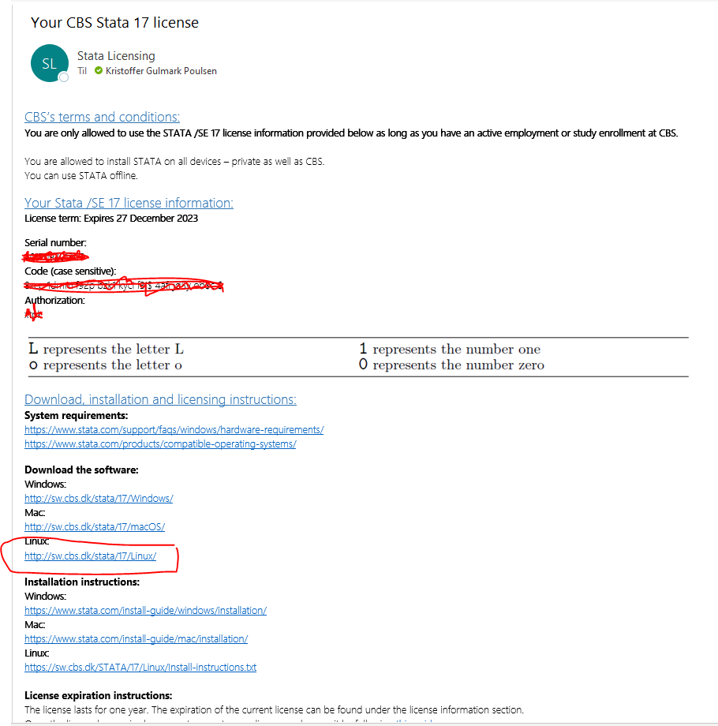
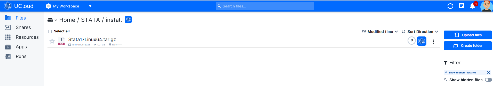
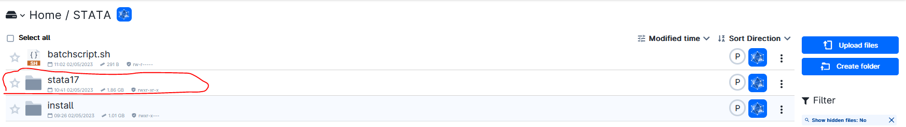
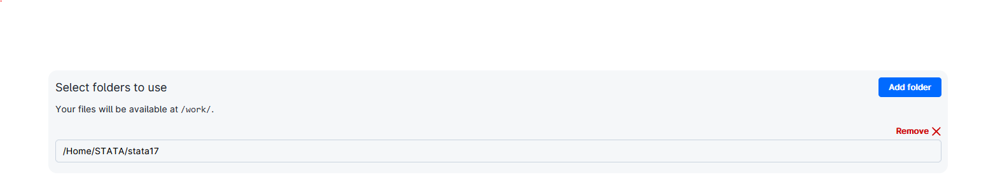

# UCloud Tutorial: Run Stata in Batch Mode on UCloud

This is an approach to adress the UCloud capacity issues. 

UCloud batch processing apps are scheduled to run as resources permit without end user interaction. It allows 


# Get Stata license and Installation file (CBS Users)

Follow the instructions to get a Stata license at CBS https://studentcbs.sharepoint.com/sites/ITandCampus/SitePages/en/Free-software.aspx

You will recieve an email with license and installation information (see image below).



 Download the installation file (Stata17Linux64.tar) and upload this to your UCloud directory.




# Installing Stata on UCloud

### Launch a "Terminal App" UCloud Job and include the stata installation file (Stata17Linux64.tar)


Run following commands in the terminal: 


```R

# Install dependencies
sudo dpkg --add-architecture i386
sudo apt-get update
sudo apt-get install libncurses5 libncurses5:i386 -y

# Unzip installation file to temp folder
sudo -s
mkdir /tmp/statafiles
cd /tmp/statafiles
tar -zxf /work/install/Stata17Linux64.tar.gz

# Install Stata on in "/work/stata17". Say yes when asked during installtion
mkdir /work/stata17 
cd /work/stata17 
/tmp/statafiles/install

# Set stata to Unix path
export PATH="/work/stata17:$PATH"

# Initialize Stata
sudo /work/stata17/stinit

# Follow instructions and add "Serial number", "Code" and "Authorization" from the Stata license mail

# Check stata installation
which stata

# Run stata
stata 
# or
stata-se
# or
stata-mp
```

### End job and copy the “stata17” folder from UCloud “Job” folder to a folder you want within your UCloud directory.



## Activate Stata installation in a new terminal job

Add the stata17 folder to the job


```R
# Install dependencies
sudo dpkg --add-architecture i386
sudo apt-get update
sudo apt-get install libncurses5 libncurses5:i386 -y

# Set stata to Unix path
export PATH="/work/stata17:$PATH"

# Check stata installation
which stata

# Run stata
stata 
# or
stata-se
# or
stata-mp
```

## Run Stata scrip in batch mode n a new terminal job

Add the "stata17" and other relevant folder to the job:



Add a bash script(.sh) under "Batch processing" as one of the "Optional Parameters":


Below shown bash script can be downloaded from [here](batchscript.sh). Use this as a template or [create your own bash script](https://www.howtogeek.com/261591/how-to-create-and-run-bash-shell-scripts-on-windows-10/).

More information on how to run Stata in batch mode can be found here: https://www.stata.com/support/faqs/unix/batch-mode/


```R
#!/bin/bash


# Installing dependencies
sudo dpkg --add-architecture i386
sudo apt-get update
sudo apt-get install libncurses5 libncurses5:i386 -y

# Set stata17 on UNIX path
export PATH="/work/stata17:$PATH"

# Run stata in Batch mode
stata -b do filename & # USER SHOULD CHANGE THIS LINE (SEE LINK Above)

```
